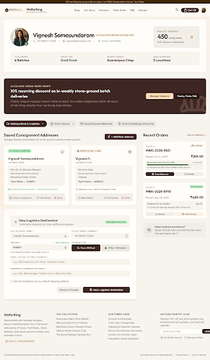

# Customer Dashboard & Address Book — WaferKing

Stitch project: `8109637399058163454`  
Screen: `0e34be73ed3345bdb22c2ae26f7e65e9`  
Canvas: 2560 × 4374  
Storefront: `/profile`

## Exact Stitch source

~~~~html
<!DOCTYPE html>

<html lang="en"><head><meta charset="utf-8"/><meta content="width=device-width, initial-scale=1.0" name="viewport"/><meta content="web_standard" name="shell-type"/><link href="https://fonts.googleapis.com/css2?family=Outfit:wght@400;600;700&amp;family=Inter:wght@400;500;600&amp;display=swap" rel="stylesheet"/><link href="https://fonts.googleapis.com/css2?family=Material+Symbols+Outlined:opsz,wght,FILL,GRAD@24,400,0,0" rel="stylesheet"/><link href="https://fonts.googleapis.com/css2?family=Material+Symbols+Outlined:wght,FILL@100..700,0..1&amp;display=swap" rel="stylesheet"/>
<link href="https://fonts.googleapis.com/css2?family=Material+Symbols+Outlined:wght,FILL@100..700,0..1&amp;display=swap" rel="stylesheet"/></head><body class="bg-background font-body-md text-on-surface antialiased"><header class="fixed top-0 left-0 right-0 z-50 shadow-[0_1px_8px_rgba(0,0,0,0.04)]">
local_shippingFree Shipping across India on orders over ₹499 | Handcrafted in Erode, Tamil Nadu

WaferKingArtisan Black Rice

<nav class="hidden lg:flex items-center gap-space-sm" data-active-classes="bg-primary-container text-on-primary font-label-lg rounded-lg"><a class="px-space-sm py-space-xs font-label-lg text-label-lg text-on-surface-variant hover:text-on-surface transition-colors" data-path="shop" href="#">Shop</a><a class="px-space-sm py-space-xs font-label-lg text-label-lg text-on-surface-variant hover:text-on-surface transition-colors" data-path="our-story" href="#">Our Story</a><a class="px-space-sm py-space-xs font-label-lg text-label-lg text-on-surface-variant hover:text-on-surface transition-colors" data-path="flavours" href="#">Flavours</a><a class="px-space-sm py-space-xs font-label-lg text-label-lg text-on-surface-variant hover:text-on-surface transition-colors" data-path="track-order" href="#">Track Order</a><a class="px-space-sm py-space-xs font-label-lg text-label-lg text-on-surface-variant hover:text-on-surface transition-colors" data-path="faq" href="#">FAQ</a><a class="px-space-sm py-space-xs font-label-lg text-label-lg text-on-surface-variant hover:text-on-surface transition-colors" data-path="contact" href="#">Contact</a></nav>
<button class="p-space-xs rounded-lg text-on-surface-variant hover:bg-surface-container-high hover:text-on-surface transition-colors" type="button">search</button><button class="flex items-center gap-space-xs px-space-md py-space-xs rounded-full bg-primary-container text-on-primary hover:bg-primary-700 transition-colors" type="button">shopping_bagCart (3)</button>

</header><main class="w-full pt-20 bg-background">

<!-- User Profile Header & Member Status -->
<section class="relative bg-background-cream rounded-xl p-space-lg md:p-space-xl shadow-sm mb-space-xl">

verified

<h1 class="font-headline-lg text-headline-lg text-primary tracking-tight">Vignesh Somasundaram</h1>

eco
                  Artisan Pantry Member since Sept 2026
                

call
                  +91 98427 12345
                
•

alternate_email
                  vignesh@example.com
                
•

location_on
                  Erode, Tamil Nadu
                

<!-- Loyalty Card & Seed Balance -->

Harvest Rewards

450
Loyalty Seeds

₹45 discount unlockable

grain

<!-- Metric highlights strip -->

Total Orders
4 Batches

Pantry Tier
Gold Grain

Favorite Crunch
Avarampoo Crisp

Saved Addresses
2 Locations

</section>
<!-- Pantry Subscription Perks Banner -->
<section class="relative overflow-hidden rounded-xl bg-primary-container text-on-primary p-space-lg md:p-space-xl mb-space-xl shadow-md">

bakery_dining

all_inclusive
              Exclusive Artisan Pantry Benefit
            

<h2 class="font-headline-md text-headline-md text-on-primary">10% recurring discount on bi-weekly stone-ground batch deliveries</h2>

              Freshly crisped Karuppu Kavuni heirloom black rice wafers dispatched within 48 hours of kiln firing directly from our Erode farm kitchen.
            

<button class="px-space-lg py-space-sm rounded-lg bg-tertiary-fixed text-primary font-label-lg text-label-lg hover:bg-tertiary-fixed-dim transition-all shadow-sm" type="button">
              Manage Cadence
            </button>
<button class="px-space-md py-space-sm rounded-lg bg-primary-700 text-on-primary font-label-lg text-label-lg hover:bg-primary transition-colors" type="button">
              Pantry Perks FAQ
            </button>

</section>
<!-- Tabbed Navigation -->
<nav aria-label="Customer Profile Sections" class="flex items-center gap-space-xs overflow-x-auto no-scrollbar pb-space-sm mb-space-lg">
<button class="px-space-md py-space-sm rounded-full bg-primary-container text-on-primary font-label-lg text-label-lg shadow-sm whitespace-nowrap flex items-center gap-1.5" type="button">
local_shipping
Address Book &amp; Logistics
2
</button>
<button class="px-space-md py-space-sm rounded-full bg-surface-container-high text-on-surface-variant hover:text-on-surface font-label-lg text-label-lg hover:bg-surface-variant transition-colors whitespace-nowrap flex items-center gap-1.5" type="button">
receipt_long
Order History
4
</button>
<button class="px-space-md py-space-sm rounded-full bg-surface-container-high text-on-surface-variant hover:text-on-surface font-label-lg text-label-lg hover:bg-surface-variant transition-colors whitespace-nowrap flex items-center gap-1.5" type="button">
credit_card
Saved Payment Methods
</button>
<button class="px-space-md py-space-sm rounded-full bg-surface-container-high text-on-surface-variant hover:text-on-surface font-label-lg text-label-lg hover:bg-surface-variant transition-colors whitespace-nowrap flex items-center gap-1.5" type="button">
shield_person
Account Settings &amp; Security
</button>
</nav>
<!-- Main Dual Layout: Address Book (Primary Active Section) + Recent Orders Snapshot -->

<!-- Left: Address Book Management Grid (8 cols) -->
<section class="lg:col-span-8 flex flex-col gap-space-lg">

<h2 class="font-headline-md text-headline-md text-primary">Saved Consignment Addresses</h2>

Manage delivery destinations for stone-ground botanical wafer parcels.

<button class="px-space-md py-space-sm rounded-lg bg-primary-container text-on-primary hover:bg-primary-700 font-label-lg text-label-lg transition-colors flex items-center gap-1.5 shrink-0 shadow-sm" id="toggle-add-address-btn" type="button">
add_location_alt
+ Add New Address
</button>

<!-- Address Cards Grid -->

<!-- Card 1: Default Primary Address -->
<article class="relative flex flex-col justify-between bg-background-cream rounded-xl p-space-lg shadow-sm">

check_circle
                    DEFAULT SHIPPING
                  

home

<h3 class="font-headline-sm text-headline-sm text-primary">Vignesh Somasundaram</h3>

+91 98427 12345

Plot 42, Sri Bhavani Nilayam
Near Sengunthar School Ground
Perundurai Road, Erode
Tamil Nadu — 638011

local_shipping
Erode District Express Hub — Same Day Kiln Dispatch

verified
Default Consignment

<button class="px-space-sm py-1 rounded-md text-on-surface-variant hover:text-primary hover:bg-surface-variant font-label-sm text-label-sm transition-colors flex items-center gap-1" type="button">
edit
                    Edit Address
                  </button>
<button class="px-space-sm py-1 rounded-md text-error hover:bg-error-container font-label-sm text-label-sm transition-colors flex items-center gap-1" title="Cannot delete default address" type="button">
delete
                    Delete
                  </button>

</article>
<!-- Card 2: Secondary Office Address -->
<article class="relative flex flex-col justify-between bg-background-cream rounded-xl p-space-lg shadow-sm">

business
                    OFFICE (10 AM - 6 PM)
                  

corporate_fare

<h3 class="font-headline-sm text-headline-sm text-primary">Vignesh S.</h3>

+91 98427 12345

84 Anna Salai
Guindy Industrial Estate, Phase II
Chennai
Tamil Nadu — 600032

schedule
Weekdays only • Deliver to Reception desk

<button class="px-space-sm py-1 rounded-md text-accent-700 hover:bg-accent-50 font-label-sm text-label-sm transition-colors flex items-center gap-1 font-semibold" type="button">
radio_button_unchecked
                  Make Default
                </button>

<button class="px-space-sm py-1 rounded-md text-on-surface-variant hover:text-primary hover:bg-surface-variant font-label-sm text-label-sm transition-colors flex items-center gap-1" type="button">
edit
                    Edit Address
                  </button>
<button class="px-space-sm py-1 rounded-md text-error hover:bg-error-container font-label-sm text-label-sm transition-colors flex items-center gap-1" type="button">
delete
                    Delete
                  </button>

</article>

<!-- Quick Inline Add New Address Form Modal/Panel Preview -->

add_location

<h3 class="font-headline-sm text-headline-sm text-primary">New Logistics Destination</h3>

Tamil Nadu domestic pin code verification enabled.

                Tamil Nadu Direct Line
              

<form class="grid grid-cols-1 md:grid-cols-2 gap-space-md" onsubmit="event.preventDefault(); alert('New delivery address successfully synchronized!');">
<!-- Full Name -->

<label class="font-label-sm text-label-sm text-primary-300 uppercase tracking-wider" for="address-fullname">Full Recipient Name *</label>

<input class="w-full bg-surface-container-low px-space-md py-space-sm rounded-lg font-body-sm text-body-sm text-primary focus:bg-background-cream focus:outline-none focus:ring-2 focus:ring-accent-700/30 transition-all" id="address-fullname" required="" type="text" value="Vignesh Somasundaram"/>
person

<!-- Phone -->

<label class="font-label-sm text-label-sm text-primary-300 uppercase tracking-wider" for="address-phone">10-Digit Mobile Number *</label>

<input class="w-full bg-surface-container-low px-space-md py-space-sm rounded-lg font-body-sm text-body-sm text-primary focus:bg-background-cream focus:outline-none focus:ring-2 focus:ring-accent-700/30 transition-all" id="address-phone" required="" type="tel" value="+91 98427 12345"/>
phone_android

<!-- Pincode Auto-Lookup -->

<label class="font-label-sm text-label-sm text-primary-300 uppercase tracking-wider" for="address-pincode">Pincode *</label>

check Auto-detected
                  

<input class="w-full bg-surface-container-low px-space-md py-space-sm rounded-lg font-body-sm text-body-sm text-primary focus:bg-background-cream focus:outline-none focus:ring-2 focus:ring-accent-700/30 transition-all font-semibold" id="address-pincode" maxlength="6" type="text" value="638001"/>
pin_drop

Erode Head Post Office, Tamil Nadu (Zone 1)

<!-- Address Type selector -->

<label class="font-label-sm text-label-sm text-primary-300 uppercase tracking-wider">Address Type</label>

<label class="flex items-center justify-center gap-1.5 px-space-sm py-space-xs rounded-lg bg-primary-container text-on-primary font-label-md text-label-md cursor-pointer transition-colors">
<input checked="" class="hidden" name="addr-type" type="radio" value="home"/>
cottage
Home (All Day)
</label>
<label class="flex items-center justify-center gap-1.5 px-space-sm py-space-xs rounded-lg bg-surface-container-high text-on-surface-variant font-label-md text-label-md cursor-pointer hover:bg-surface-variant transition-colors">
<input class="hidden" name="addr-type" type="radio" value="office"/>
apartment
Office / Workspace
</label>

<!-- Street Address Line 1 -->

<label class="font-label-sm text-label-sm text-primary-300 uppercase tracking-wider" for="address-street">Door / Flat No. &amp; Street Address *</label>
<input class="w-full bg-surface-container-low px-space-md py-space-sm rounded-lg font-body-sm text-body-sm text-primary placeholder-primary-50 focus:bg-background-cream focus:outline-none focus:ring-2 focus:ring-accent-700/30 transition-all" id="address-street" placeholder="e.g. 14/B Nasiyanur Link Road, Teachers Colony" required="" type="text"/>

<!-- Landmark -->

<label class="font-label-sm text-label-sm text-primary-300 uppercase tracking-wider" for="address-landmark">Prominent Landmark (Optional)</label>
<input class="w-full bg-surface-container-low px-space-md py-space-sm rounded-lg font-body-sm text-body-sm text-primary placeholder-primary-50 focus:bg-background-cream focus:outline-none focus:ring-2 focus:ring-accent-700/30 transition-all" id="address-landmark" placeholder="e.g. Opp. Balamurugan Temple Arch or Near Bus Stop" type="text"/>

<!-- Set as Default Checkbox -->

<label class="flex items-center gap-space-xs cursor-pointer select-none">
<input class="w-4 h-4 rounded text-primary-container focus:ring-0 bg-surface-container" id="mark-default" type="checkbox"/>
Set this destination as my default shipping address
</label>

<!-- CTA buttons -->

<button class="px-space-md py-space-sm rounded-lg bg-surface-container text-on-surface-variant font-label-lg text-label-lg hover:bg-surface-container-high transition-colors" type="reset">
                  Discard Changes
                </button>
<button class="px-space-xl py-space-sm rounded-lg bg-primary-container text-on-primary hover:bg-primary-700 font-label-lg text-label-lg shadow-sm transition-all flex items-center gap-1.5" type="submit">
save
                  Save Logistics Destination
                </button>

</form>

</section>
<!-- Right: Recent Orders Snapshot & Logistics Tracking (4 cols) -->
<aside class="lg:col-span-4 flex flex-col gap-space-lg">

<h2 class="font-headline-md text-headline-md text-primary">Recent Orders</h2>
<a class="font-label-sm text-label-sm text-accent-700 hover:text-primary font-semibold flex items-center gap-0.5 transition-colors" href="#">
              View All 4 Batches
              arrow_forward
</a>

<!-- Order Card 1: In Transit -->
<article class="bg-background-cream rounded-xl p-space-md shadow-sm flex flex-col gap-space-sm">

Order ID
<h4 class="font-headline-sm text-headline-sm text-primary font-bold">#WK-2026-9821</h4>

departure_board
                In Transit
              

Placed: Oct 2, 2026
₹289.00

<!-- Mini tracker bar -->

local_shipping
                  Arriving Tomorrow, by 4 PM
                
Erode Hub

                2x Avarampoo Black Rice Wafers (120g pouch)
              

<button class="w-full py-space-xs rounded-lg bg-primary-container text-on-primary hover:bg-primary-700 font-label-sm text-label-sm font-semibold transition-colors flex items-center justify-center gap-1 shadow-sm" type="button">
radar
                Track Shipment
              </button>
<button class="w-full py-space-xs rounded-lg bg-surface-container text-on-surface hover:bg-surface-container-high font-label-sm text-label-sm font-semibold transition-colors flex items-center justify-center gap-1" type="button">
repeat
                Reorder
              </button>

</article>
<!-- Order Card 2: Delivered -->
<article class="bg-background-cream rounded-xl p-space-md shadow-sm flex flex-col gap-space-sm">

Order ID
<h4 class="font-headline-sm text-headline-sm text-primary font-bold">#WK-2026-8910</h4>

check_circle
                Delivered
              

Placed: Sep 14, 2026
₹420.00

Handed over to recipient
Sep 16

1x The Royal Heritage Sampler Box (4 Flavors)

<button class="w-full py-space-xs rounded-lg bg-surface-container text-on-surface hover:bg-surface-container-high font-label-sm text-label-sm font-semibold transition-colors flex items-center justify-center gap-1" type="button">
download
                Invoice
              </button>
<button class="w-full py-space-xs rounded-lg bg-accent-50 text-accent-700 hover:bg-accent-700 hover:text-on-primary font-label-sm text-label-sm font-semibold transition-colors flex items-center justify-center gap-1" type="button">
rate_review
                Write Review
              </button>

</article>
<!-- Artisan Help / Direct Kitchen Contact Card -->

support_agent

<h4 class="font-label-lg text-label-lg text-primary">Need logistics assistance?</h4>

Speak directly with our Erode kitchen team.

<a class="font-label-sm text-label-sm text-secondary hover:underline font-semibold mt-1 inline-flex items-center gap-0.5" href="#">
                Chat with Dispatch Hub
                arrow_outward
</a>

</aside>

</main><footer class="w-full bg-surface-container-low shadow-[0_1px_8px_rgba(0,0,0,0.04)] pt-space-xl pb-space-lg text-on-surface">

WaferKing

Handcrafted with heirloom Karuppu Kavuni traditional black rice in the Kaveri delta plains of Erode, Tamil Nadu. Clean wellness, slow stone-ground nutrition, and exquisite crunch.

verifiedFSSAI Lic. #12423008000492

<h4 class="font-label-lg text-label-lg text-primary uppercase tracking-wider">The Collection</h4><ul class="flex flex-col gap-space-xs font-body-sm text-body-sm text-on-surface-variant"><li><a class="hover:text-on-surface transition-colors" data-path="shop" href="#">Avarampoo Black Rice Wafers</a></li><li><a class="hover:text-on-surface transition-colors" data-path="shop" href="#">Hibiscus Petal Crunch Wafers</a></li><li><a class="hover:text-on-surface transition-colors" data-path="shop" href="#">Makhana Crunch Roasted Crisps</a></li><li><a class="hover:text-on-surface transition-colors" data-path="shop" href="#">Vallarai Herbal Infused Crisp</a></li><li><a class="hover:text-on-surface transition-colors" data-path="shop" href="#">The Royal Heritage Sampler Box</a></li></ul>

<h4 class="font-label-lg text-label-lg text-primary uppercase tracking-wider">Customer Care</h4><ul class="flex flex-col gap-space-xs font-body-sm text-body-sm text-on-surface-variant"><li><a class="hover:text-on-surface transition-colors" data-path="profile" href="#">Account &amp; Addresses</a></li><li><a class="hover:text-on-surface transition-colors" data-path="track-order" href="#">Track Your Consignment</a></li><li><a class="hover:text-on-surface transition-colors" data-path="shipping-policy" href="#">Shipping &amp; Domestic Express</a></li><li><a class="hover:text-on-surface transition-colors" data-path="returns-and-refund" href="#">Returns &amp; Freshness Guarantee</a></li><li><a class="hover:text-on-surface transition-colors" data-path="contact" href="#">Contact Our Kitchen Team</a></li><li><a class="hover:text-on-surface transition-colors" data-path="faq" href="#">Frequently Asked Questions</a></li></ul>

<h4 class="font-label-lg text-label-lg text-primary uppercase tracking-wider">Artisan Pantry Club</h4>
Receive 10% off your initial sampler box, botanical harvest updates, and seasonal specials.
<form class="flex flex-col sm:flex-row gap-space-xs pt-space-xs" onsubmit="return false;"><input class="flex-1 bg-background-cream px-space-md py-space-xs rounded-lg font-body-sm text-body-sm text-primary placeholder-primary-50 focus:outline-none" placeholder="Enter your email" type="email"/><button class="px-space-md py-space-xs rounded-lg bg-primary-container text-on-primary hover:bg-primary-700 font-label-lg text-label-lg transition-colors" type="submit">Join</button></form>

lock256-Bit SSL Secured

shieldRazorpay Verified

© 2026 WaferKing Foods Private Limited. Handcrafted in Erode, Tamil Nadu, India.

All Prices Inclusive of Applicable GST•<a class="hover:text-on-surface transition-colors" data-path="privacy-policy" href="#">Privacy Policy</a>•<a class="hover:text-on-surface transition-colors" data-path="terms-of-service" href="#">Terms of Service</a>

</footer></body></html>
~~~~
