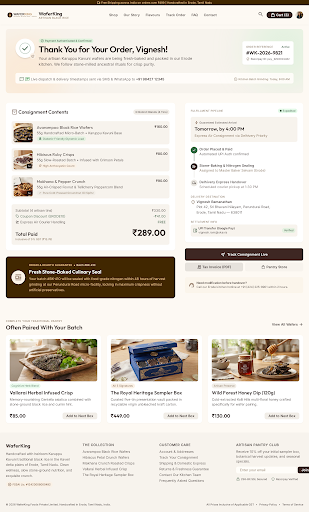

# Order Confirmation & Success — WK-2026-9821

Stitch project: `8109637399058163454`  
Screen: `988bb34e6aaa4dfd9257274e92de4b9b`  
Canvas: 2560 × 4242  
Storefront: `/success`

## Exact Stitch source

~~~~html
<!DOCTYPE html>

<html lang="en"><head><meta charset="utf-8"/><meta content="width=device-width, initial-scale=1.0" name="viewport"/><meta content="web_standard" name="shell-type"/><link href="https://fonts.googleapis.com/css2?family=Outfit:wght@400;600;700&amp;family=Inter:wght@400;500;600&amp;display=swap" rel="stylesheet"/><link href="https://fonts.googleapis.com/css2?family=Material+Symbols+Outlined:opsz,wght,FILL,GRAD@24,400,0,0" rel="stylesheet"/><link href="https://fonts.googleapis.com/css2?family=Material+Symbols+Outlined:wght,FILL@100..700,0..1&amp;display=swap" rel="stylesheet"/>
<link href="https://fonts.googleapis.com/css2?family=Material+Symbols+Outlined:wght,FILL@100..700,0..1&amp;display=swap" rel="stylesheet"/></head><body class="bg-background font-body-md text-on-surface antialiased"><header class="fixed top-0 left-0 right-0 z-50 shadow-[0_1px_8px_rgba(0,0,0,0.04)]">
local_shippingFree Shipping across India on orders over ₹499 | Handcrafted in Erode, Tamil Nadu

WaferKingArtisan Black Rice

<nav class="hidden lg:flex items-center gap-space-sm" data-active-classes="bg-primary-container text-on-primary font-label-lg rounded-lg"><a class="px-space-sm py-space-xs font-label-lg text-label-lg text-on-surface-variant hover:text-on-surface transition-colors" data-path="shop" href="#">Shop</a><a class="px-space-sm py-space-xs font-label-lg text-label-lg text-on-surface-variant hover:text-on-surface transition-colors" data-path="our-story" href="#">Our Story</a><a class="px-space-sm py-space-xs font-label-lg text-label-lg text-on-surface-variant hover:text-on-surface transition-colors" data-path="flavours" href="#">Flavours</a><a class="px-space-sm py-space-xs font-label-lg text-label-lg text-on-surface-variant hover:text-on-surface transition-colors" data-path="track-order" href="#">Track Order</a><a class="px-space-sm py-space-xs font-label-lg text-label-lg text-on-surface-variant hover:text-on-surface transition-colors" data-path="faq" href="#">FAQ</a><a class="px-space-sm py-space-xs font-label-lg text-label-lg text-on-surface-variant hover:text-on-surface transition-colors" data-path="contact" href="#">Contact</a></nav>
<button class="p-space-xs rounded-lg text-on-surface-variant hover:bg-surface-container-high hover:text-on-surface transition-colors" type="button">search</button><button class="flex items-center gap-space-xs px-space-md py-space-xs rounded-full bg-primary-container text-on-primary hover:bg-primary-700 transition-colors" type="button">shopping_bagCart (3)</button>

</header><main class="w-full pt-20 bg-background">

<!-- Top Celebration Hero Block -->

<!-- Ambient organic background halo -->

<!-- Animated Checkmark Emblem -->

<svg class="w-10 h-10 md:w-12 md:h-12 text-secondary" fill="none" viewbox="0 0 48 48">
<circle class="opacity-30" cx="24" cy="24" r="22" stroke="currentColor" stroke-dasharray="140" stroke-dashoffset="0" stroke-width="2.5"></circle>
<path d="M14 24.5L21 31.5L34 17.5" stroke="currentColor" stroke-linecap="round" stroke-linejoin="round" stroke-width="3.5"></path>
</svg>

eco

check_circle
Payment Authenticated &amp; Confirmed

<h1 class="font-headline-lg text-headline-lg text-primary tracking-tight">
              Thank You for Your Order, Vignesh!
            </h1>

              Your artisan Karuppu Kavuni wafers are being fresh-baked and packed in our Erode kitchen. We follow stone-milled ancestral rituals for crisp purity.
            

<!-- Quick Reference Chip -->

Order Reference
Active

#WK-2026-9821

verified_user
Razorpay ID: pay_NZ92019482

<!-- Notification pill notification bar -->

sms
chat

            Live dispatch &amp; delivery timestamps sent via SMS &amp; WhatsApp to <strong class="text-primary font-semibold">+91 98427 12345</strong>

schedule
Kitchen Batch Grinding: Today, 6:00 AM

<!-- Main Asymmetric Bento Content Grid -->

<!-- Left 7-Cols: Consignment Items & Kitchen Dispatch Timeline -->

<!-- Artisan Parcel Items Card -->

inventory_2
<h2 class="font-headline-sm text-headline-sm text-primary">Consignment Contents</h2>

              3 Distinct Blends (4 Tins)
            

<!-- Item 1: Avarampoo Black Rice -->

2x

<h3 class="font-headline-sm text-[17px] text-primary truncate">Avarampoo Black Rice Wafers</h3>

55g Handcrafted Micro-Batch • Karuppu Kavuni Base

₹160.00

local_florist Diabetic-Friendly Glycemic Load
                

<!-- Item 2: Hibiscus Ruby Crisps -->

1x

<h3 class="font-headline-sm text-[17px] text-primary truncate">Hibiscus Ruby Crisps</h3>

55g Slow-Roasted Batch • Infused with Crimson Petals

₹80.00

energy_savings_leaf High Anthocyanin Count
                

<!-- Item 3: Makhana & Pepper Crunch -->

1x

<h3 class="font-headline-sm text-[17px] text-primary truncate">Makhana &amp; Pepper Crunch</h3>

55g Air-Crisped Foxnut &amp; Tellicherry Peppercorn Blend

₹90.00

done Pure Cold-Pressed Groundnut Oil Spritz
                

<!-- Bill Summary Breakout -->

Subtotal (4 artisan tins)
₹330.00

sell Coupon Discount (ERODE10)
              
-₹41.00

flight_takeoff Express Air Courier Handling
              
FREE

Total Paid
Inclusive of 5% GST (₹13.76)

₹289.00

<!-- Erode Freshness Guarantee Seal Box -->

format_image_left

Origin &amp; Hearth Guarantee
•
Batch #BK-410

<h3 class="font-headline-sm text-headline-sm text-on-tertiary mt-0.5">Fresh Stone-Baked Culinary Seal</h3>

              Your batch #BK-410 will be sealed with food-grade nitrogen within 48 hours of harvest grinding at our Perundurai Road micro-facility, locking in maximum crispness without artificial preservatives.
            

<!-- Right 5-Cols: Fulfillment, Route, and CTA actions -->

<!-- Dispatch & Transit Route Card -->

Fulfillment Pipeline

 Expedited
            

<!-- Estimated Delivery Highlights -->

bolt Guaranteed Estimated Arrival
            

Tomorrow, by 4:00 PM

Express Air Consignment via Delhivery Priority

<!-- Step Progression Indicator -->

<!-- Step 1 Done -->

done

Order Placed &amp; Paid
Automated UPI Auth confirmed

<!-- Step 2 Active -->

skillet

Stone-Baking &amp; Nitrogen Sealing
Assigned to Master Baker Selvam (Erode)

<!-- Step 3 Pending -->

local_shipping

Delhivery Express Handover
Scheduled courier pickup at 1:30 PM

<!-- Delivery Destination Block -->

Delivery Destination

location_on

Vignesh Ramanathan

                  Plot 42, Sri Bhavani Nilayam, Perundurai Road, 
                  Erode, Tamil Nadu — 638011
                

<!-- Payment Details Meta -->

Settlement Info

account_balance_wallet

UPI Transfer (Google Pay)
vignesh.ram@okaxis

                Verified
              

<!-- Action CTAs -->

<!-- Primary CTA: Track Consignment -->
<a class="w-full flex items-center justify-center gap-space-sm py-space-md px-space-lg rounded-lg bg-primary-container text-on-primary hover:bg-primary-700 font-label-lg text-label-lg shadow-sm transition-all text-center" data-path="track-order" href="#">
near_me
Track Consignment Live
</a>

<!-- Secondary CTA: Tax Invoice -->
<button class="w-full flex items-center justify-center gap-space-xs py-space-sm px-space-md rounded-lg bg-surface-container-highest hover:bg-surface-dim text-primary font-label-lg text-label-lg transition-colors" id="invoice-btn" onclick="downloadMockInvoice()" type="button">
receipt_long
Tax Invoice (PDF)
</button>
<!-- Tertiary CTA: Continue Shopping -->
<a class="w-full flex items-center justify-center gap-space-xs py-space-sm px-space-md rounded-lg bg-surface-container-low hover:bg-surface-container text-primary font-label-lg text-label-lg transition-colors text-center" data-path="shop" href="#">
shopping_bag
Pantry Store
</a>

<!-- Small Reassurance Footer Card -->

support_agent

Need modification before handover?
Call our Erode kitchen hotline at +91 (424) 225-8901 within 2 hours.

<!-- Suggested Additions / Pantry Complement Carousel -->

Complete Your Traditional Pantry
<h2 class="font-headline-md text-headline-md text-primary">Often Paired With Your Batch</h2>

<a class="font-label-lg text-label-lg text-primary hover:text-accent-700 flex items-center gap-1 transition-colors" data-path="shop" href="#">
View All Wafers
arrow_forward
</a>

<!-- Complement Card 1 -->

Cognitive Herb Blend

<h3 class="font-headline-sm text-headline-sm text-primary">Vallarai Herbal Infused Crisp</h3>

              Memory-nourishing Centella asiatica combined with stone-ground black rice and cumin hint.
            

₹85.00
<button class="px-space-md py-space-xs rounded-lg bg-surface-container hover:bg-surface-variant text-primary font-label-lg text-label-lg transition-colors" type="button">
              Add to Next Box
            </button>

<!-- Complement Card 2 -->

All 5 Signatures

<h3 class="font-headline-sm text-headline-sm text-primary">The Royal Heritage Sampler Box</h3>

              Curated five-tin presentation vault packed in recyclable virgin unbleached kraft carton.
            

₹449.00
<button class="px-space-md py-space-xs rounded-lg bg-surface-container hover:bg-surface-variant text-primary font-label-lg text-label-lg transition-colors" type="button">
              Add to Next Box
            </button>

<!-- Complement Card 3: Kaveri Delta Honey Dipper -->

Artisan Preserve

<h3 class="font-headline-sm text-headline-sm text-primary">Wild Forest Honey Dip (120g)</h3>

              Cold-extracted Kolli Hills multi-floral honey crafted specifically for wafer pairing.
            

₹130.00
<button class="px-space-md py-space-xs rounded-lg bg-surface-container hover:bg-surface-variant text-primary font-label-lg text-label-lg transition-colors" type="button">
              Add to Next Box
            </button>

</main><footer class="w-full bg-surface-container-low shadow-[0_1px_8px_rgba(0,0,0,0.04)] pt-space-xl pb-space-lg text-on-surface">

WaferKing

Handcrafted with heirloom Karuppu Kavuni traditional black rice in the Kaveri delta plains of Erode, Tamil Nadu. Clean wellness, slow stone-ground nutrition, and exquisite crunch.

verifiedFSSAI Lic. #12423008000492

<h4 class="font-label-lg text-label-lg text-primary uppercase tracking-wider">The Collection</h4><ul class="flex flex-col gap-space-xs font-body-sm text-body-sm text-on-surface-variant"><li><a class="hover:text-on-surface transition-colors" data-path="shop" href="#">Avarampoo Black Rice Wafers</a></li><li><a class="hover:text-on-surface transition-colors" data-path="shop" href="#">Hibiscus Petal Crunch Wafers</a></li><li><a class="hover:text-on-surface transition-colors" data-path="shop" href="#">Makhana Crunch Roasted Crisps</a></li><li><a class="hover:text-on-surface transition-colors" data-path="shop" href="#">Vallarai Herbal Infused Crisp</a></li><li><a class="hover:text-on-surface transition-colors" data-path="shop" href="#">The Royal Heritage Sampler Box</a></li></ul>

<h4 class="font-label-lg text-label-lg text-primary uppercase tracking-wider">Customer Care</h4><ul class="flex flex-col gap-space-xs font-body-sm text-body-sm text-on-surface-variant"><li><a class="hover:text-on-surface transition-colors" data-path="profile" href="#">Account &amp; Addresses</a></li><li><a class="hover:text-on-surface transition-colors" data-path="track-order" href="#">Track Your Consignment</a></li><li><a class="hover:text-on-surface transition-colors" data-path="shipping-policy" href="#">Shipping &amp; Domestic Express</a></li><li><a class="hover:text-on-surface transition-colors" data-path="returns-and-refund" href="#">Returns &amp; Freshness Guarantee</a></li><li><a class="hover:text-on-surface transition-colors" data-path="contact" href="#">Contact Our Kitchen Team</a></li><li><a class="hover:text-on-surface transition-colors" data-path="faq" href="#">Frequently Asked Questions</a></li></ul>

<h4 class="font-label-lg text-label-lg text-primary uppercase tracking-wider">Artisan Pantry Club</h4>
Receive 10% off your initial sampler box, botanical harvest updates, and seasonal specials.
<form class="flex flex-col sm:flex-row gap-space-xs pt-space-xs" onsubmit="return false;"><input class="flex-1 bg-background-cream px-space-md py-space-xs rounded-lg font-body-sm text-body-sm text-primary placeholder-primary-50 focus:outline-none" placeholder="Enter your email" type="email"/><button class="px-space-md py-space-xs rounded-lg bg-primary-container text-on-primary hover:bg-primary-700 font-label-lg text-label-lg transition-colors" type="submit">Join</button></form>

lock256-Bit SSL Secured

shieldRazorpay Verified

© 2026 WaferKing Foods Private Limited. Handcrafted in Erode, Tamil Nadu, India.

All Prices Inclusive of Applicable GST•<a class="hover:text-on-surface transition-colors" data-path="privacy-policy" href="#">Privacy Policy</a>•<a class="hover:text-on-surface transition-colors" data-path="terms-of-service" href="#">Terms of Service</a>

</footer></body></html>
~~~~
