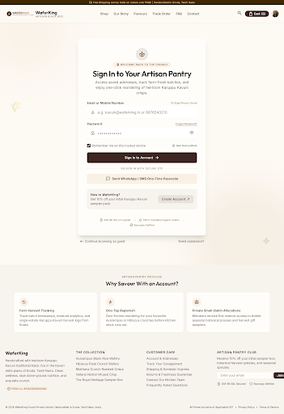

# Sign In & Authentication — WaferKing

Stitch project: `8109637399058163454`  
Screen: `6c92ccfd36984bfb96279055e56098d4`  
Canvas: 2560 × 3730  
Storefront: `/login`

## Exact Stitch source

~~~~html
<!DOCTYPE html>

<html lang="en"><head><meta charset="utf-8"/><meta content="width=device-width, initial-scale=1.0" name="viewport"/><meta content="web_standard" name="shell-type"/><link href="https://fonts.googleapis.com/css2?family=Outfit:wght@400;600;700&amp;family=Inter:wght@400;500;600&amp;display=swap" rel="stylesheet"/><link href="https://fonts.googleapis.com/css2?family=Material+Symbols+Outlined:opsz,wght,FILL,GRAD@24,400,0,0" rel="stylesheet"/><link href="https://fonts.googleapis.com/css2?family=Material+Symbols+Outlined:wght,FILL@100..700,0..1&amp;display=swap" rel="stylesheet"/>
<link href="https://fonts.googleapis.com/css2?family=Material+Symbols+Outlined:wght,FILL@100..700,0..1&amp;display=swap" rel="stylesheet"/></head><body class="bg-background font-body-md text-on-surface antialiased"><header class="fixed top-0 left-0 right-0 z-50 shadow-[0_1px_8px_rgba(0,0,0,0.04)]">
local_shippingFree Shipping across India on orders over ₹499 | Handcrafted in Erode, Tamil Nadu

WaferKingArtisan Black Rice

<nav class="hidden lg:flex items-center gap-space-sm" data-active-classes="bg-primary-container text-on-primary font-label-lg rounded-lg"><a class="px-space-sm py-space-xs font-label-lg text-label-lg text-on-surface-variant hover:text-on-surface transition-colors" data-path="shop" href="#">Shop</a><a class="px-space-sm py-space-xs font-label-lg text-label-lg text-on-surface-variant hover:text-on-surface transition-colors" data-path="our-story" href="#">Our Story</a><a class="px-space-sm py-space-xs font-label-lg text-label-lg text-on-surface-variant hover:text-on-surface transition-colors" data-path="flavours" href="#">Flavours</a><a class="px-space-sm py-space-xs font-label-lg text-label-lg text-on-surface-variant hover:text-on-surface transition-colors" data-path="track-order" href="#">Track Order</a><a class="px-space-sm py-space-xs font-label-lg text-label-lg text-on-surface-variant hover:text-on-surface transition-colors" data-path="faq" href="#">FAQ</a><a class="px-space-sm py-space-xs font-label-lg text-label-lg text-on-surface-variant hover:text-on-surface transition-colors" data-path="contact" href="#">Contact</a></nav>
<button class="p-space-xs rounded-lg text-on-surface-variant hover:bg-surface-container-high hover:text-on-surface transition-colors" type="button">search</button><button class="flex items-center gap-space-xs px-space-md py-space-xs rounded-full bg-primary-container text-on-primary hover:bg-primary-700 transition-colors" type="button">shopping_bagCart (3)</button>

</header><main class="w-full pt-20 bg-background">

      🌾
    

      ✦
    

spa

local_florist
Welcome Back to the Crunch

<h1 class="font-headline-lg text-headline-lg text-primary tracking-tight">
            Sign In to Your Artisan Pantry
          </h1>

            Access saved addresses, track farm-fresh batches, and enjoy one-click reordering of heirloom Karuppu Kavuni crisps.
          

<form class="mt-space-lg flex flex-col gap-space-md" onsubmit="return false;">

<label class="font-label-lg text-label-lg text-primary flex items-center justify-between" for="login-identifier">
Email or Mobile Number
10-Digit Phone / Email
</label>

                person
              
<input autocomplete="username" class="w-full bg-transparent pl-12 pr-space-md py-3.5 rounded-lg font-body-md text-body-md text-primary placeholder-primary-50 focus:outline-none transition-all" id="login-identifier" placeholder="e.g. kavuni@waferking.in or 9876543210" type="text"/>

<label class="font-label-lg text-label-lg text-primary" for="login-password">
                Password
              </label>
<a class="font-label-sm text-label-sm text-accent-700 hover:text-primary transition-colors underline underline-offset-4" href="#">
                Forgot Password?
              </a>

                lock
              
<input autocomplete="current-password" class="w-full bg-transparent pl-12 pr-12 py-3.5 rounded-lg font-body-md text-body-md text-primary placeholder-primary-50 focus:outline-none transition-all" id="login-password" placeholder="••••••••••••" type="password"/>
<button aria-label="Toggle password visibility" class="absolute right-space-sm p-1.5 text-primary-50 hover:text-primary transition-colors rounded" id="toggle-password-btn" onclick="
                  const input = document.getElementById('login-password');
                  const icon = this.querySelector('span');
                  if (input.type === 'password') {
                    input.type = 'text';
                    icon.textContent = 'visibility_off';
                  } else {
                    input.type = 'password';
                    icon.textContent = 'visibility';
                  }
                " type="button">
visibility
</button>

<label class="flex items-center gap-space-sm cursor-pointer select-none">
<input checked="" class="w-4 h-4 rounded text-primary-container bg-surface-container accent-primary-container focus:ring-0 focus:outline-none cursor-pointer" type="checkbox"/>
Remember me on this trusted device
</label>

verified_user
              Safe Device Mode
            

<button class="w-full py-3.5 px-space-md rounded-lg bg-primary-container hover:bg-primary-700 text-on-primary font-label-lg text-label-lg flex items-center justify-center gap-space-sm shadow-md transition-all active:scale-[0.99] group mt-1" type="submit">
Sign In to Account

              arrow_forward
            
</button>
</form>

            Or Sign In With Secure OTP
          

<button class="w-full py-3 px-space-md rounded-lg bg-accent-50 hover:bg-surface-container-high text-primary font-label-lg text-label-lg flex items-center justify-center gap-space-sm transition-all shadow-sm" onclick="
              const banner = document.getElementById('otp-status');
              banner.classList.remove('hidden');
              setTimeout(() =&gt; banner.classList.add('hidden'), 5000);
            " type="button">
sms
Send WhatsApp / SMS One-Time Passcode
</button>

check_circle
OTP sent securely to your registered phone/WhatsApp.

New to WaferKing?

Get 10% off your initial Karuppu Kavuni sampler pack.

<a class="whitespace-nowrap px-space-md py-2 rounded-lg bg-surface-container-highest hover:bg-background-warm text-accent-700 font-label-lg text-label-lg transition-colors flex items-center gap-1" data-path="register" href="#">
Create Account
north_east
</a>

lock
256-Bit SSL Encrypted

•

eco
100% Traceable Organic Grains

•

verified
Razorpay Verified

<a class="inline-flex items-center gap-1 hover:text-primary transition-colors" data-path="shop" href="#">
west
Continue browsing as guest
</a>
<a class="hover:text-primary transition-colors" data-path="contact" href="#">
          Need assistance?
        </a>

<section class="w-full bg-surface-container-low py-space-xl px-gutter-sm md:px-gutter">

Artisan Pantry Privilege
<h2 class="font-headline-md text-headline-md text-primary mt-1">Why Savour With an Account?</h2>

history

<h3 class="font-label-lg text-label-lg text-primary">Farm Harvest Tracking</h3>

Trace batch timestamps, moisture analytics, and single-estate Karuppu Kavuni harvest logs from Erode.

bolt

<h3 class="font-label-lg text-label-lg text-primary">One-Tap Replenish</h3>

Zero-friction reordering for your favourite Avarampoo or Hibiscus crunches before kitchen stock runs out.

redeem

<h3 class="font-label-lg text-label-lg text-primary">Private Small-Batch Allocations</h3>

Members receive first reserve access to limited seasonal botanical presses and harvest gift samplers.

</section>

</main><footer class="w-full bg-surface-container-low shadow-[0_1px_8px_rgba(0,0,0,0.04)] pt-space-xl pb-space-lg text-on-surface">

WaferKing

Handcrafted with heirloom Karuppu Kavuni traditional black rice in the Kaveri delta plains of Erode, Tamil Nadu. Clean wellness, slow stone-ground nutrition, and exquisite crunch.

verifiedFSSAI Lic. #12423008000492

<h4 class="font-label-lg text-label-lg text-primary uppercase tracking-wider">The Collection</h4><ul class="flex flex-col gap-space-xs font-body-sm text-body-sm text-on-surface-variant"><li><a class="hover:text-on-surface transition-colors" data-path="shop" href="#">Avarampoo Black Rice Wafers</a></li><li><a class="hover:text-on-surface transition-colors" data-path="shop" href="#">Hibiscus Petal Crunch Wafers</a></li><li><a class="hover:text-on-surface transition-colors" data-path="shop" href="#">Makhana Crunch Roasted Crisps</a></li><li><a class="hover:text-on-surface transition-colors" data-path="shop" href="#">Vallarai Herbal Infused Crisp</a></li><li><a class="hover:text-on-surface transition-colors" data-path="shop" href="#">The Royal Heritage Sampler Box</a></li></ul>

<h4 class="font-label-lg text-label-lg text-primary uppercase tracking-wider">Customer Care</h4><ul class="flex flex-col gap-space-xs font-body-sm text-body-sm text-on-surface-variant"><li><a class="hover:text-on-surface transition-colors" data-path="profile" href="#">Account &amp; Addresses</a></li><li><a class="hover:text-on-surface transition-colors" data-path="track-order" href="#">Track Your Consignment</a></li><li><a class="hover:text-on-surface transition-colors" data-path="shipping-policy" href="#">Shipping &amp; Domestic Express</a></li><li><a class="hover:text-on-surface transition-colors" data-path="returns-and-refund" href="#">Returns &amp; Freshness Guarantee</a></li><li><a class="hover:text-on-surface transition-colors" data-path="contact" href="#">Contact Our Kitchen Team</a></li><li><a class="hover:text-on-surface transition-colors" data-path="faq" href="#">Frequently Asked Questions</a></li></ul>

<h4 class="font-label-lg text-label-lg text-primary uppercase tracking-wider">Artisan Pantry Club</h4>
Receive 10% off your initial sampler box, botanical harvest updates, and seasonal specials.
<form class="flex flex-col sm:flex-row gap-space-xs pt-space-xs" onsubmit="return false;"><input class="flex-1 bg-background-cream px-space-md py-space-xs rounded-lg font-body-sm text-body-sm text-primary placeholder-primary-50 focus:outline-none" placeholder="Enter your email" type="email"/><button class="px-space-md py-space-xs rounded-lg bg-primary-container text-on-primary hover:bg-primary-700 font-label-lg text-label-lg transition-colors" type="submit">Join</button></form>

lock256-Bit SSL Secured

shieldRazorpay Verified

© 2026 WaferKing Foods Private Limited. Handcrafted in Erode, Tamil Nadu, India.

All Prices Inclusive of Applicable GST•<a class="hover:text-on-surface transition-colors" data-path="privacy-policy" href="#">Privacy Policy</a>•<a class="hover:text-on-surface transition-colors" data-path="terms-of-service" href="#">Terms of Service</a>

</footer></body></html>
~~~~
